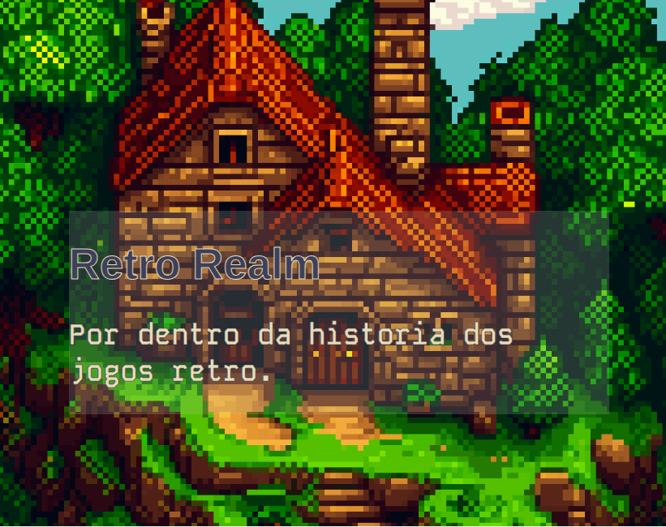

# Retro Realm
## Tarefas
- [x] Header
- [x] Apresentação
- [x] Jogos
- [x] Formulário
- [x] Sobre

---

# Retro Realm

Este site é um projeto de web desing do quinto semestre de Engenharia de Computação. Retro Realm é um site dedicado a explorar e celebrar a nostalgia dos jogos retrô. Ele oferece informações sobre jogos clássicos, curiosidades e uma variedade de recursos para entusiastas de videogames.

## Conteúdo

- [Visão Geral](#visão-geral)
- [Recursos](#recursos)
- [Página](#página)
- [Contribuição](#contribuição)
- [Autores](#autores)

## Visão Geral

Os jogos retrô têm um lugar especial no coração de muitos gamers. O Retro Realm foi criado para capturar essa nostalgia e compartilhá-la com uma comunidade apaixonada. Neste site, você encontrará uma variedade de informações sobre jogos clássicos, desde resumos até curiosidades sobre o desenvolvimento.

## Recursos

- Catálogo de Jogos Retro
- Breva apresentação sobre Jogos Retro
- Formulário de Solicitação de Jogos Ausentes
- Seção Sobre os Autores

## Página

https://goncalvs98.github.io/retro-realm/

## Contribuição

Se você deseja contribuir para o Retro Realm, siga estas etapas:

1. Faça um fork do repositório.
2. Crie uma branch para sua contribuição (`git checkout -b feature/nova-feature`).
3. Faça suas alterações e commit (`git commit -am 'Adiciona uma nova feature'`).
4. Faça push para a branch (`git push origin feature/nova-feature`).
5. Abra um pull request.

## Autores

- [Gabriel Gonçalves](https://github.com/Goncalvs98)
- [Daniel Okudaira Carapeto](https://github.com/DanielOkudaira)

---